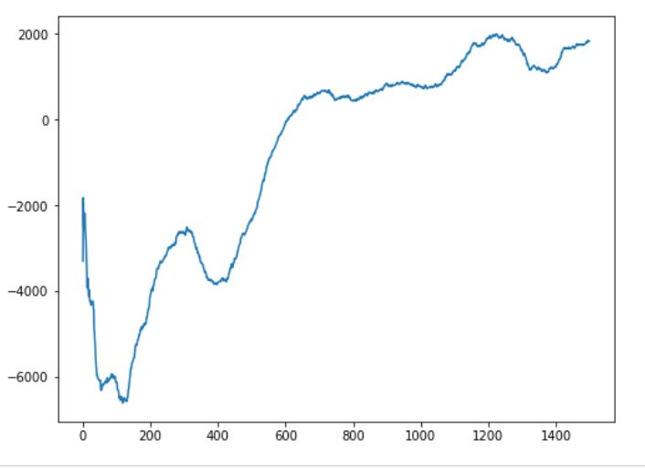

# Custom_Reward_Lunar_Lander-V2
Implementation of Lunar-Lander-v2 with a custom reward function in Python.

This is an implementation of Lunar-Lander-v2 using openAI gym. Please check the custom reward function given in lunar_lander.py (under env_step).

 
<h2> Reward vs Episodes plot </h2>
</img>
